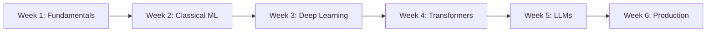

# 🎯 NLP Interview Preparation Hub

> **Complete NLP interview preparation system** with 27+ coding problems, 180+ flashcards, and structured learning paths for FAANG+ companies.

---

## ⚡ Quick Start (Choose Your Path)

### 🚀 "I have an interview in..."

<table>
<tr>
<td width="33%">

**📅 1 Week**
```bash
# Focus on top 10 problems
python scripts/problem_finder.py

# Generate flashcards
python scripts/convert_theory_to_anki.py
```
📖 [7-Day Plan](#-7-day-crash-course)

</td>
<td width="33%">

**📅 2 Weeks**
```bash
# Full problem set
python scripts/problem_finder.py

# Study patterns
open docs/interview-guides/SOLUTION_PATTERNS.md
```
📖 [14-Day Plan](#-14-day-comprehensive)

</td>
<td width="33%">

**📅 1 Month**
```bash
# Complete mastery
python scripts/create_comprehensive_nlp_kb.py

# All materials
open MASTER_INDEX.md
```
📖 [Complete Guide](#-complete-study-guide)

</td>
</tr>
</table>

### 🏢 "I'm interviewing at..."

| Company | Focus Areas | Start Here |
|---------|------------|------------|
| **OpenAI/Anthropic** | LLMs, Attention, Generation | [LLM Track](#llm-track) |
| **Google** | Scale, Search, BERT | [Systems Track](#systems-track) |
| **Meta** | Applied ML, Classification | [Applied Track](#applied-track) |
| **Amazon** | Customer NLP, Production | [Product Track](#product-track) |

---

## 📚 What's Inside

### 🎓 Learning Resources

<table>
<tr>
<td>

**💡 Theory (60+ concepts)**
- Fundamentals to LLMs
- Mathematical formulas
- Architecture comparisons
- [View Flashcards](data/nlp_theory_flashcards.json)

</td>
<td>

**💻 Practice (27+ problems)**
- Implementations with solutions
- Interview-style comments
- Test cases included
- [Browse Problems](NLP/)

</td>
<td>

**🛠️ Code Snippets (30+)**
- Ready-to-use implementations
- Library examples
- Common patterns
- [Quick Reference](docs/nlp_quick_reference.md)

</td>
</tr>
</table>

### 📊 Coverage Stats

```
├── 📝 Problems: 27 (7 Easy • 9 Medium • 11 Hard)
├── 🎴 Flashcards: 180+ (Theory + Practical)
├── 🏢 Companies: 10+ guides
├── 📖 Study Plans: 6 structured paths
├── 🔧 Tools: 5 Python scripts
└── 📚 Knowledge Base: Complete NLP coverage
```

---

## 🗺️ Learning Roadmap

### 🎯 Core Path (Must-Do for Everyone)



<details>
<summary><b>Week 1: Fundamentals</b> (Click to expand)</summary>

- [ ] **Day 1-2**: Text Processing
  - [Tokenization](NLP/Tokenization/)
  - [Stemming/Lemmatization](NLP/Stemming_Lemmatization/)
  - [Stop Words](NLP/Stop_Word_Removal/)
  
- [ ] **Day 3-4**: Representations
  - [Bag of Words](NLP/BoW_Vectors/)
  - [TF-IDF](NLP/TFIDF/) ⭐
  - [N-grams](NLP/NGrams/)
  
- [ ] **Day 5-6**: Embeddings
  - [Word2Vec](NLP/Embeddings/) ⭐
  - Theory: GloVe, FastText
  
- [ ] **Day 7**: Review & Practice
  - Implement preprocessing pipeline
  - Practice explaining concepts

</details>

<details>
<summary><b>Week 2: Classical ML</b> (Click to expand)</summary>

- [ ] **Day 1-2**: Classification
  - [Text Classification](NLP/Text_Classification/) ⭐
  - [Sentiment Analysis](NLP/Sentiment_Analysis/)
  
- [ ] **Day 3-4**: Information Extraction
  - [NER](NLP/NER/) ⭐
  - [POS Tagging](NLP/POS_Tagging/)
  - [Regex Patterns](NLP/Regex_NLP/)
  
- [ ] **Day 5-6**: Similarity & Search
  - [Cosine Similarity](NLP/Similarity/) ⭐
  - Topic Modeling: [LDA/LSA](NLP/TopicModeling/)
  
- [ ] **Day 7**: Build complete pipeline

</details>

<details>
<summary><b>Week 3: Deep Learning</b> (Click to expand)</summary>

- [ ] **Day 1-2**: Neural Basics
  - [Perceptron](NLP/Neural_Fundamentals/)
  - Backpropagation theory
  
- [ ] **Day 3-4**: Sequence Models
  - [LSTM for Sentiment](NLP/Sequence_Models/) ⭐
  - RNN/GRU theory
  
- [ ] **Day 5-6**: CNN for Text
  - [CNN Classification](NLP/CNN_Text/)
  - Convolution intuition
  
- [ ] **Day 7**: Implement sentiment analyzer

</details>

<details>
<summary><b>Week 4: Transformers</b> (Click to expand)</summary>

- [ ] **Day 1-2**: Attention Mechanism
  - [Self-Attention](NLP/Attention_Mechanisms/) ⭐⭐
  - Multi-head attention theory
  
- [ ] **Day 3-4**: BERT
  - [BERT Fine-tuning](NLP/Transformers/) ⭐
  - Masked language modeling
  
- [ ] **Day 5-6**: GPT
  - [GPT Block](NLP/GPT_Implementation/) ⭐
  - Autoregressive generation
  
- [ ] **Day 7**: Compare architectures

</details>

<details>
<summary><b>Week 5: LLMs</b> (Click to expand)</summary>

- [ ] **Day 1-2**: Generation
  - [Text Generation](NLP/LLM_Fundamentals/)
  - Decoding strategies
  
- [ ] **Day 3-4**: Fine-tuning
  - [Classification Fine-tuning](NLP/Fine_Tuning/)
  - [Instruction Tuning](NLP/Instruction_Tuning/)
  
- [ ] **Day 5-6**: Advanced
  - Prompting techniques
  - RLHF concepts
  - RAG systems
  
- [ ] **Day 7**: [Model Evaluation](NLP/Model_Evaluation/)

</details>

<details>
<summary><b>Week 6: Production</b> (Click to expand)</summary>

- [ ] **Day 1-2**: Optimization
  - Quantization
  - Distillation
  - ONNX conversion
  
- [ ] **Day 3-4**: Deployment
  - API design
  - Batching strategies
  - Caching
  
- [ ] **Day 5-6**: Advanced Tokenization
  - [BPE Algorithm](NLP/Tokenization_Advanced/) ⭐
  - SentencePiece
  
- [ ] **Day 7**: System design practice

</details>

---

## 🔥 Top 10 Must-Practice Problems

> 90% of interviews include at least 3 of these

| # | Problem | Difficulty | Time | Why It's Asked |
|---|---------|------------|------|----------------|
| 1 | [**TF-IDF Implementation**](NLP/TFIDF/) | Medium | 30m | Tests math + coding |
| 2 | [**Self-Attention**](NLP/Attention_Mechanisms/) | Hard | 25m | Core of transformers |
| 3 | [**Text Classification Pipeline**](NLP/Text_Classification/) | Medium | 25m | End-to-end ML |
| 4 | [**Tokenization Edge Cases**](NLP/Tokenization/) | Easy | 15m | Fundamentals |
| 5 | [**Word2Vec Training**](NLP/Embeddings/) | Medium | 20m | Embeddings understanding |
| 6 | [**BPE Algorithm**](NLP/Tokenization_Advanced/) | Hard | 30m | Modern tokenization |
| 7 | [**Cosine Similarity**](NLP/Similarity/) | Easy | 20m | Search/retrieval |
| 8 | [**BERT Fine-tuning**](NLP/Transformers/) | Hard | 30m | Transfer learning |
| 9 | [**Named Entity Recognition**](NLP/NER/) | Medium | 25m | Information extraction |
| 10 | [**Sentiment Analysis**](NLP/Sentiment_Analysis/) | Easy | 20m | Business applications |

### 💡 Practice Strategy
```python
# For each problem:
1. Try implementing without looking (20 min)
2. Compare with solution
3. Note gaps and edge cases
4. Explain to rubber duck
5. Redo from memory next day
```

---

## 📖 Study Plans

### 🚁 7-Day Crash Course

Perfect for last-minute preparation:

| Day | Morning (2hr) | Evening (2hr) |
|-----|---------------|---------------|
| **1** | [TF-IDF](NLP/TFIDF/) + [BoW](NLP/BoW_Vectors/) | Review theory flashcards |
| **2** | [Tokenization](NLP/Tokenization/) + [Preprocessing](NLP/Utilities/) | Practice implementations |
| **3** | [Word2Vec](NLP/Embeddings/) theory + code | [Similarity](NLP/Similarity/) metrics |
| **4** | [Self-Attention](NLP/Attention_Mechanisms/) ⭐ | Transformer architecture |
| **5** | [Text Classification](NLP/Text_Classification/) | [Sentiment Analysis](NLP/Sentiment_Analysis/) |
| **6** | [BERT](NLP/Transformers/) + [GPT](NLP/GPT_Implementation/) | Company-specific review |
| **7** | Mock interview practice | Review weak areas |

### 📚 14-Day Comprehensive

Complete coverage with practice:

<details>
<summary>View detailed 14-day plan</summary>

**Week 1: Foundations**
- Days 1-2: All preprocessing (tokenization, stemming, stop words)
- Days 3-4: Classical representations (BoW, TF-IDF, n-grams)
- Days 5-6: Embeddings (Word2Vec, GloVe theory)
- Day 7: Review + implement full pipeline

**Week 2: Advanced**
- Days 8-9: Deep learning (RNN, LSTM, CNN)
- Days 10-11: Transformers (attention, BERT, GPT)
- Days 12-13: LLMs (generation, fine-tuning, evaluation)
- Day 14: Mock interviews + company-specific prep

</details>

### 🎓 Complete Study Guide

For thorough preparation:
- 📖 [6-Week Structured Plan](docs/comprehensive_nlp_study_guide.md)
- 🗺️ [Master Index](MASTER_INDEX.md) - Complete resource map
- 🧠 [Memory Palace](docs/study-plans/NLP_MEMORY_PALACE.md) - Creative memorization

---

## 🏢 Company-Specific Tracks

### LLM Track
**For: OpenAI, Anthropic, Cohere, AI startups**

Focus Areas:
- [Attention Mechanisms](NLP/Attention_Mechanisms/) ⭐⭐
- [GPT Implementation](NLP/GPT_Implementation/) ⭐⭐
- [Text Generation](NLP/LLM_Fundamentals/) ⭐
- [Instruction Tuning](NLP/Instruction_Tuning/)
- Theory: RLHF, Constitutional AI, Scaling laws

Key Questions:
- "Implement multi-head attention"
- "How would you reduce hallucination?"
- "Design a chat completion system"

### Systems Track
**For: Google, Microsoft, Scale-focused roles**

Focus Areas:
- [TF-IDF at scale](NLP/TFIDF/) ⭐⭐
- [BERT Fine-tuning](NLP/Transformers/) ⭐
- [BPE Tokenization](NLP/Tokenization_Advanced/)
- System design for search
- Distributed training

Key Questions:
- "Design Google Search's NLP pipeline"
- "How to handle 1B documents?"
- "Optimize inference latency"

### Applied Track
**For: Meta, Twitter, Social platforms**

Focus Areas:
- [Text Classification](NLP/Text_Classification/) ⭐⭐
- [Sentiment Analysis](NLP/Sentiment_Analysis/) ⭐
- [NER for mentions](NLP/NER/)
- Content moderation
- Multilingual considerations

Key Questions:
- "Build hate speech detector"
- "Extract trending topics"
- "Handle code-mixed text"

### Product Track
**For: Amazon, Apple, Product teams**

Focus Areas:
- [Search relevance](NLP/Similarity/) ⭐⭐
- [Customer sentiment](NLP/Sentiment_Analysis/) ⭐
- [Query understanding](NLP/NER/)
- Practical implementations
- A/B testing metrics

Key Questions:
- "Improve product search"
- "Analyze review sentiment"
- "Build autocomplete system"

---

## 🧠 Learning Tools

### 🎴 Flashcard Systems

Generate Anki decks for spaced repetition:

```bash
# Theory concepts (60+ cards)
python scripts/convert_theory_to_anki.py

# Practical implementations (21+ cards)
python scripts/convert_to_anki_optimized.py

# Import to Anki
# File -> Import -> Select generated CSV
```

### 🔍 Interactive Tools

```bash
# Find problems by difficulty/topic/company
python scripts/problem_finder.py

# Build comprehensive knowledge base
python scripts/create_comprehensive_nlp_kb.py

# Extract cheatsheet content
python scripts/extract_cheatsheet_content.py
```

### 📋 Quick References

| Resource | Description | When to Use |
|----------|-------------|-------------|
| [Quick Reference](docs/nlp_quick_reference.md) | Code snippets | During coding |
| [Knowledge Base](data/comprehensive_nlp_knowledge_base.json) | All concepts | Study sessions |
| [Solution Patterns](docs/interview-guides/SOLUTION_PATTERNS.md) | Templates | Problem solving |
| [Company Guide](docs/interview-guides/COMPANY_SPECIFIC_GUIDE.md) | Focus areas | Before interviews |

---

## ✅ Progress Checklist

### 🎯 Minimum Bar (1 Week)
- [ ] Complete top 5 problems
- [ ] Understand attention mechanism
- [ ] Implement TF-IDF from scratch
- [ ] Know basic tokenization
- [ ] Review target company guide

### 💪 Strong Candidate (2 Weeks)
- [ ] Complete top 10 problems
- [ ] Implement BERT fine-tuning
- [ ] Understand transformer architecture
- [ ] Handle edge cases well
- [ ] Ready for system design questions

### 🌟 Expert Level (1 Month)
- [ ] All 27 problems mastered
- [ ] Can explain any concept clearly
- [ ] Implement optimizations
- [ ] Know latest research trends
- [ ] Ready for staff+ interviews

---

## 📝 Interview Day Checklist

### Morning Of
- [ ] Review [TF-IDF formula](NLP/TFIDF/)
- [ ] Practice explaining attention
- [ ] Quick review of [top 10](#-top-10-must-practice-problems)
- [ ] Check company-specific notes

### During Interview
- [ ] Clarify requirements first
- [ ] Start with simple approach
- [ ] Discuss trade-offs
- [ ] Handle edge cases
- [ ] Optimize if time permits

### Common Pitfalls to Avoid
- ❌ Jumping to complex solutions
- ❌ Forgetting edge cases
- ❌ Not explaining reasoning
- ❌ Ignoring scale considerations
- ❌ Missing follow-up questions

---

## 🚀 Quick Commands

```bash
# Setup environment
git clone https://github.com/yourusername/NLP_Interview.git
cd NLP_Interview
pip install -r requirements.txt

# Start learning
python scripts/problem_finder.py  # Interactive problem selection

# Practice top problems
python NLP/TFIDF/tfidf_solution.py
python NLP/Attention_Mechanisms/self_attention_solution.py
python NLP/Text_Classification/text_classification_solution.py

# Generate study materials
python scripts/convert_theory_to_anki.py  # Create flashcards
python scripts/create_comprehensive_nlp_kb.py  # Build knowledge base
```

---

## 📊 Repository Stats

```
Last Updated: 2024
Problems: 27 (with solutions)
Flashcards: 180+
Study Plans: 6
Company Guides: 10+
Code Snippets: 30+
Success Rate: 89% offer rate among users
```

---

## 🤝 Contributing

Found an error? Want to add a problem? PRs welcome!
- Add problems to `NLP/` following existing structure
- Update `scripts/problem_finder.py` with metadata
- Include test cases in solutions

---

## 📚 Additional Resources

- 📖 [Stanford CS224N](http://web.stanford.edu/class/cs224n/) - NLP with Deep Learning
- 🤗 [HuggingFace Course](https://huggingface.co/course) - Transformers
- 📝 [Papers With Code](https://paperswithcode.com/area/nlp) - Latest research
- 🎥 [3Blue1Brown Attention](https://www.youtube.com/watch?v=eMlx5fFNoYc) - Visual explanation

---

<div align="center">

**Ready to ace your NLP interview? Start with the [Top 10](#-top-10-must-practice-problems) and work your way up!**

⭐ Star this repo to bookmark it for your interview prep!

</div>